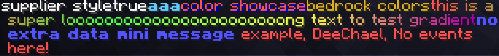

# adventure-kt

> [!WARNING]
>
> This project is still **working in progress**.
>
> Some interfaces may not work / change in the future.
>
> Use it as your own risk.

⛏️ (Probably) Full Kotlin support for [Kyori Adventure](https://github.com/KyoriPowered/adventure).

## 🤔 purpose

Since Kotlin brought us the ability to create [Extensions](https://kotlinlang.org/docs/extensions.html), we can create DSLs.

This project aimed to create many DSL utilities for adventure's builder pattern API, which make your life easier.

## 📦 artifacts

###  repository

```kotlin
repositories {
    maven(uri("https://maven.nostal.ink/repository/maven-public/"))
}
```

### dependency

```kotlin
dependencies {
    // Use shadowJar to shade the artifact into your jar
    api("ink.pmc.advkt:v2:1.0.0")
}

tasks.shadowJar {
    relocate("ink.pmc.advkt", "com.example.libs.advkt")
}
```

## ☕ usage

### creating a component

```kotlin
component {
    text("This is a text component, nothing special.") // simply create a component
    text { "Text component here" } // lambda with return
    translatable { "gui.ok" } // use locale related string
    keybind { "key.inventory" } // use keybinds related string
    raw { Component.text("text") } // use adventure component directly
    mini("<red>mini message!") // use mini message
}
```

### apply style
```kotlin
component {
    // style 1
    // due to shadow colors is customizable, color now split into text types and shadow types
    // simply add text and shadow in front of colors to use color types in advkt v2
    text("text") with textRed and shadowBlack without italic and color // nothing changed at result because "without color" is the latest step
    text("text") with underlined and textAqua and runCommand("/say hello") // with "underlined" decoration, "aqua" text color and "run command" click event
}
```

### actions override
You can override some actions for better usage.  
For example, to make use of newline component to create a list of components instead of use linebreak
```kotlin
fun lore(content: ComponentKt.() -> Unit): ItemLore {
    val components = mutableListOf<Component>()
    val last = component {
        actions {
            newlineAction {
                components.add(it.cleanBuild())
            }
        }
        content()
    }
    components.add(last)
    return ItemLore.lore(components)
}
```

### creating a title (WIP for v2)

```kotlin
title {
    mainTitle {
        text("This is a main title.")
    }
    subTitle {
        text("This is a sub title.")
    }
    // support both Kotlin duration and Java duration
    times {
        fadeIn(1.seconds)
        stay(1.seconds)
        fadeOut(1.seconds)
    }
}
```

### full usage example
Screenshot

Code
```kotlin
component {
        miniMessage {
            strict()
            tags {
                tag("aa", Tag.inserting(Component.text("aa")))
            }
            provide(MiniMessage.miniMessage()) // highest priority
        }

        actions {

            newlineAction {
                it.value = null // clear the original component
            }

        }

        replacements {
            override()
            replacement {
                once()
                matchLiteral("fuck")
                replace {
                    space()
                    text("****") with textRed and underlined
                    space()
                }
            }
        }

        text { "supplier style" }
        text { true }
        text("aaa") with "#66ccff" and bold and strikethrough without italic and strikethrough
        text("color showcase") with textRed with shadowDarkBlue
        text("bedrock colors") with textMaterialGold

        text("this is a super looooooooooooooooooooooong text to test gradient") with textGradient(red, green, yellow, darkPurple)

        // use component default mini message
        mini("<blue><bold>no extra data mini message")

        // use default mini message with custom placeholder and other things
        mini("<red> example, <name>, <events>") {
            unparsedPlaceholder("name", "DeeChael")
            componentPlaceholder("events") {
                text("No events here!")
            }
        }
    }
```
